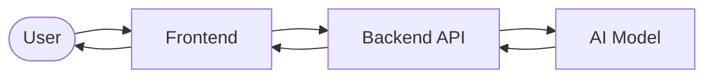

# LUMA-AI

<div id="top" align="center">


<br /><br />

**Light up what you're working on.**

<a href="https://github.com/Swarup-Surwase/LUMA-AI">
  
</a>

<br />


<br /><br />

[Overview](#-overview) •
[Features](#-features) •
[How it works](#-how-it-works) •
[Get started](#-get-started) •
[Roadmap](#-roadmap) •
[Contribute](#-contributing) •
[FAQ](#-faq)

</div>

---

## ✨ Overview

**LUMA AI** is a platform that *(replace this with one or two plain sentences: what it does and who it's for)*.

> Example: LUMA AI helps students and creators get answers, generate content, and automate repetitive work, all from one simple interface.

<details>
<summary><b>🎯 Why LUMA AI?</b> (click to expand)</summary>

<br />

- **The problem:** *describe the problem your platform solves.*
- **The approach:** *describe how LUMA AI solves it differently.*
- **Who it's for:** *students, developers, businesses, creators...*

</details>

---

## 🚀 Features

> ✏️ These are sample features. Replace them with what LUMA AI really does.

| | Feature | What it does |
|---|---|---|
| 💬 | **Smart conversations** | Ask questions in plain language and get clear answers. |
| ⚡ | **Fast responses** | Results arrive quickly, even for longer requests. |
| 🧩 | **Easy to extend** | Add new tools, models, or integrations without rewriting the core. |
| 🔒 | **Privacy-minded** | Your data stays yours. Explain your approach here. |
| 📱 | **Works everywhere** | Responsive on desktop and mobile. |

<details>
<summary><b>📸 Screenshots</b></summary>

<br />

<!-- Add your images to assets/ and update the paths below -->

| Home | Chat / Dashboard |
|:---:|:---:|
|  |  |

</details>

<details>
<summary><b>🎬 Demo</b></summary>

<br />

Add a GIF or a link to a live demo here:

```md

```

[🌐 Live demo](#) · [🎥 Video walkthrough](#)

</details>

<p align="right"><a href="#top">⬆ back to top</a></p>

---

## 🧠 How it works



*Edit the boxes above to match your real architecture (for example: React → Node.js → Gemini API).*

---

## 🛠 Tech stack

<details open>
<summary><b>Built with</b></summary>

<br />

| Layer | Technology |
|---|---|
| Frontend | *e.g. React, HTML/CSS/JS* |
| Backend | *e.g. Node.js, Python (FastAPI / Flask)* |
| AI / ML | *e.g. OpenAI, Gemini, Hugging Face, Claude* |
| Database | *e.g. MongoDB, PostgreSQL, Firebase* |
| Hosting | *e.g. Vercel, Render, AWS* |

</details>

---

## 🏁 Get started

### Prerequisites

- Git
- *Node.js 18+ and/or Python 3.10+ (keep what applies)*
- An API key for your AI provider *(if used)*

### Installation

```bash
git clone https://github.com/Swarup-Surwase/LUMA-AI.git
cd LUMA-AI
```

<details>
<summary><b>🟢 Node.js project</b></summary>

```bash
npm install
cp .env.example .env     # add your keys
npm run dev
```

</details>

<details>
<summary><b>🐍 Python project</b></summary>

```bash
python -m venv venv
source venv/bin/activate        # Windows: venv\Scripts\activate
pip install -r requirements.txt
cp .env.example .env            # add your keys
python app.py
```

</details>

<details>
<summary><b>🔑 Environment variables</b></summary>

| Variable | Description |
|---|---|
| `API_KEY` | Key for your AI provider |
| `PORT` | Port the app runs on (optional) |

> Never commit your `.env` file. Add it to `.gitignore`.

</details>

Then open **http://localhost:3000** (or the port your app prints).

<p align="right"><a href="#top">⬆ back to top</a></p>

---

## 📁 Project structure

<details>
<summary><b>Show folder layout</b></summary>

```text
LUMA-AI/
├── assets/          # logo, screenshots
├── src/             # application source
├── public/          # static files
├── .env.example     # sample environment variables
└── README.md
```

*Update this tree to match your repo.*

</details>

---

## 🗺 Roadmap

- [x] Project setup
- [ ] Core AI features
- [ ] User accounts
- [ ] Mobile-friendly design
- [ ] Public launch

Have an idea? [Open an issue](https://github.com/Swarup-Surwase/LUMA-AI/issues).

---

## 🤝 Contributing

Contributions are welcome.

1. Fork the repo
2. Create a branch: `git checkout -b feature/your-feature`
3. Commit your changes: `git commit -m "Add your feature"`
4. Push: `git push origin feature/your-feature`
5. Open a pull request

---

## ❓ FAQ

<details>
<summary><b>Is LUMA AI free to use?</b></summary>

<br />

*Answer here.*

</details>

<details>
<summary><b>Which AI model does it use?</b></summary>

<br />

*Answer here.*

</details>

<details>
<summary><b>How do I report a bug?</b></summary>

<br />

Open an issue with the steps to reproduce it and a screenshot if you can.

</details>

---

## 📄 License

Distributed under the **MIT License**. See `LICENSE` for details. *(Change this if you use a different license.)*

## 📬 Contact

**Swarup Surwase** · [GitHub](https://github.com/Swarup-Surwase) · [Project link](https://github.com/Swarup-Surwase/LUMA-AI)

<div align="center">

⭐ If LUMA AI helps you, give the repo a star.

</div>
