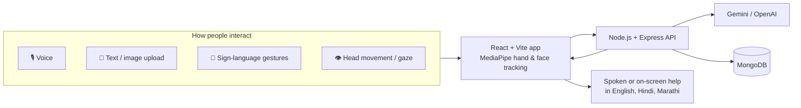

<div id="top" align="center">


<br /><br />

**An AI-powered accessibility platform that adapts to the way you want to interact.**

<a href="https://github.com/Swarup-Surwase/LUMA-AI">
  
</a>

<br />


<br /><br />

[Overview](#-overview) •
[Features](#-features) •
[How it works](#-how-it-works) •
[Get started](#-get-started) •
[Contribute](#-contributing)

</div>

---

## ✨ Overview

**LUMA** is an AI-powered, multimodal accessibility platform that helps people with disabilities, language barriers, and low digital literacy use digital services **independently**.

You can speak naturally, upload text or images, use sign-language gestures, or navigate hands-free with head movement. LUMA adapts to the way *you* prefer to interact, with no special hardware needed.

<details>
<summary><b>🎯 Who is LUMA for?</b> (click to expand)</summary>

<br />

- **People with disabilities** who find standard forms, websites, and keyboards hard to use.
- **People facing language barriers**, with support for English, Hindi, and Marathi.
- **People with low digital literacy** who need guidance, plain language, and voice help to finish online tasks.

</details>

---

## 🚀 Features

| | Feature | What it does |
|---|---|---|
| 🎙️ | **Voice-guided form filling** | Speak your answers and LUMA guides you through the form. |
| 📄 | **Plain-language document simplification** | Upload text or an image of a document and get an easy-to-understand version. |
| 🤟 | **Indian Sign Language recognition** | Recognizes ISL gestures and gives text and speech output. |
| 👁️ | **Gaze-based typing** | Type with an on-screen keyboard, using your gaze. |
| 🧭 | **Hands-free navigation** | Move through the app with head movement or voice commands. |
| 🌐 | **Multilingual** | Works in English, Hindi (हिन्दी), and Marathi (मराठी). |

<details>
<summary><b>🔍 Under the hood</b></summary>

<br />

- **AI text simplification** turns complex language into plain language.
- **OCR** reads text from uploaded images.
- **Speech-to-text** and **text-to-speech** let people talk to LUMA and hear it respond.
- **Voice-based navigation** moves through the app by command.
- **MediaPipe** tracks hands and face in real time, in the browser.

</details>

<p align="right"><a href="#top">⬆ back to top</a></p>

---

## 🌍 Real-life use

| Need | How LUMA helps |
|---|---|
| Apply for a disability grant | Guides the person through the form by voice, step by step. |
| Understand a government notice | Simplifies the notice into plain language, in their language. |
| Communicate with confidence | Turns sign language into text and speech, and gaze into typed words. |

> LUMA removes communication barriers, so people can complete everyday tasks on their own terms.

---

## 🧠 How it works



---

## 🛠 Tech stack


<details>
<summary><b>Stack details</b></summary>

<br />

| Layer | Technology |
|---|---|
| Frontend | React with Vite and TypeScript |
| Backend | Node.js with Express |
| Database | MongoDB |
| AI processing | Gemini and OpenAI |
| Real-time tracking | MediaPipe (hand and face, in the browser) |

</details>

---

## 🏁 Get started

### Prerequisites

- Node.js 18 or newer
- A MongoDB database (local or Atlas)
- An API key for Gemini and/or OpenAI
- A device with a camera and microphone (needed for gesture, gaze, head-movement, and voice features)

### Installation

```bash
git clone https://github.com/Swarup-Surwase/LUMA-AI.git
cd LUMA-AI
```

<!-- ✏️ Check the commands below against your package.json scripts. -->

<details open>
<summary><b>1️⃣ Install dependencies</b></summary>

```bash
npm install
```

If the `server/` folder has its own `package.json`:

```bash
cd server && npm install
```

</details>

<details>
<summary><b>2️⃣ Add environment variables</b></summary>

Create a `.env` file (never commit it, it is already covered by `.gitignore` if you listed it there).

| Variable | Description |
|---|---|
| `MONGODB_URI` | Your MongoDB connection string |
| `GEMINI_API_KEY` | Google Gemini API key |
| `OPENAI_API_KEY` | OpenAI API key |
| `PORT` | Backend port (optional) |

</details>

<details>
<summary><b>3️⃣ Run the app</b></summary>

Start the backend:

```bash
cd server
npm start
```

Start the frontend from the project root:

```bash
npm run dev
```

Open the local URL that Vite prints (usually `http://localhost:5173`) and allow camera and microphone access when your browser asks.

</details>

<p align="right"><a href="#top">⬆ back to top</a></p>

---

## 📁 Project structure

<details>
<summary><b>Show folder layout</b></summary>

```text
LUMA-AI/
├── public/          # static files, including the logo
├── server/          # Node.js + Express backend
├── src/             # React + TypeScript frontend
├── index.html       # Vite entry point
├── package.json
├── vite.config.ts
├── tsconfig*.json   # TypeScript config
└── .oxlintrc.json   # linter config
```

</details>

---

## 📸 Screenshots

<!-- Add images to public/ and update the paths below -->

| Home | Sign-language recognition |
|:---:|:---:|
|  |  |

---

## 🤝 Contributing

Contributions are welcome.

1. Fork the repo
2. Create a branch: `git checkout -b feature/your-feature`
3. Commit your changes: `git commit -m "feat: add your feature"`
4. Push: `git push origin feature/your-feature`
5. Open a pull request

---

## 👥 Team

| Name | Role | GitHub |
|---|---|---|
| Swarup Surwase | *your role* | [@Swarup-Surwase](https://github.com/Swarup-Surwase) |

*Add your teammates as new rows.*

## 📄 License

*Add a `LICENSE` file to the repo and name the license here.*

<div align="center">

⭐ If LUMA helps you or someone you know, give the repo a star.

</div>
